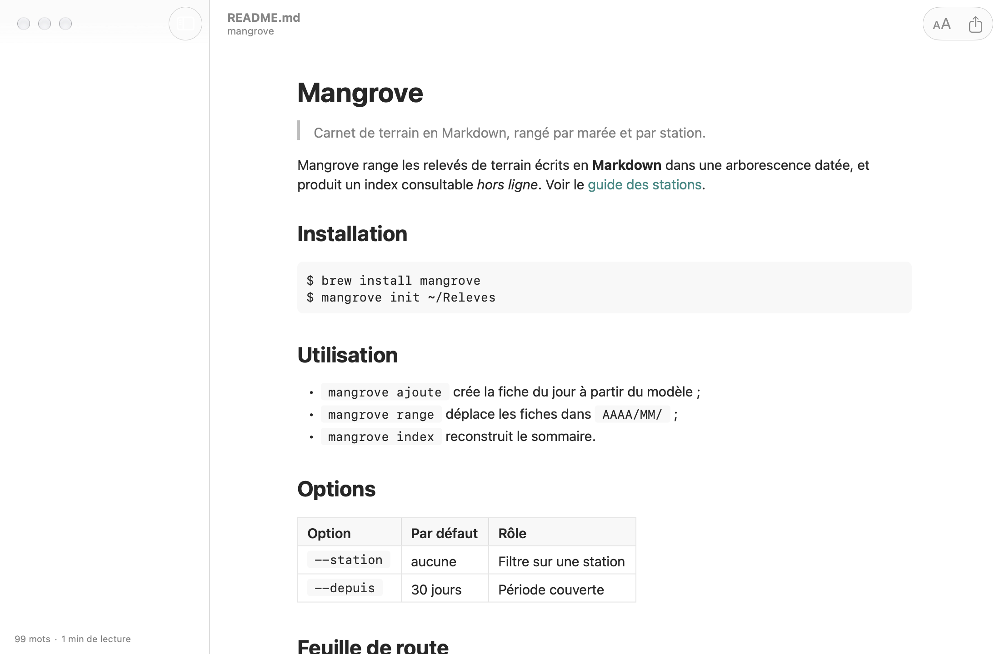

<p align="center">
  <picture>
    <source media="(prefers-color-scheme: dark)" srcset="docs/kayakoma-logo-dark.svg">
    
  </picture>
</p>

# Kayakoma Viewer

Kayakoma Viewer is a read-only Markdown reader for macOS, with a Quick Look extension so that the space bar previews `.md` files in the Finder. Rendering is native, with no WebView, no HTML and no JavaScript: it is done by KayakomaKit, the rendering engine, which lives in its own repository.

The name: "Kaya koma" means "it is not finished" in Shimaore (Mayotte) — a nod to Markdown being an unfinished document waiting to be rendered.



The sample document shown above is invented.

## Features

- Opens Markdown (`.md`, `.markdown`, `.mdown`, `.mkd`) and plain text (`.txt`) files. Documents are never modified.
- Outline sidebar, with the word count and an estimated reading time. It opens by itself from 4 headings (a setting turns this off) and a toolbar button shows or hides it.
- Reading options in the "Aa" popover of the toolbar: text size, theme, and Auto / Light / Dark appearance. Text size also has shortcuts in the View menu (Command-plus, Command-minus, Command-0).
- Themes: two built in (Default and Paper) plus your own JSON files, see [Themes](#themes).
- Live reload: the document is rendered again when the file changes on disk (a setting turns this off).
- PDF export in A4 or US Letter, with real text and clickable links (File > Export as PDF…, Option-Command-E).
- Open in Editor (Command-E) hands the file to Kayakoma Editor; the item only appears when the Editor is installed.
- Quick Look preview of Markdown files in the Finder.
- Encodings: UTF-8 (with or without BOM) and UTF-16 with BOM. A file that is not valid UTF-8 is read as Windows-1252, then as ISO Latin-1, so that it still opens. The file is displayed as it was read; nothing is converted on disk.
- Files that cannot be shown as Markdown (binary data, source code, JSON, CSV and other structured text) open a window that says so instead of garbage.
- Relative images and links are resolved from the document's folder. Remote images are not loaded.
- Interface in French and English.

## Requirements

- macOS 14 or later to run
- Xcode 26 or later (the app icon and some controls use the macOS 26 SDK), and [XcodeGen](https://github.com/yonaskolb/XcodeGen), to build

## Building from source

The app depends on [KayakomaKit](https://github.com/beeraw/kayakoma-kit), which Swift Package Manager fetches from GitHub (version 1.0.0 or later, same major version).

```bash
xcodegen generate
```

Then open `KayakomaViewer.xcodeproj` in Xcode and run the `Viewer` scheme, or build from the command line:

```bash
xcodebuild -scheme Viewer build
```

The Xcode project is generated and not versioned: change `project.yml`, never the project. The app is signed locally (ad hoc), without a developer account. To run the tests:

```bash
xcodebuild -scheme Viewer test
```

### Developing with a local KayakomaKit

To work on the engine at the same time, clone it next to this repository (`../KayakomaKit`) and create a `project.local.yml` file here. It is ignored by git and never committed:

```yaml
include:
  - project.yml
packages:
  KayakomaKit:
    path: ../KayakomaKit
```

The file reuses `project.yml` and only replaces the engine package. Generate the project from it instead of from `project.yml`:

```bash
xcodegen generate --spec project.local.yml
```

To go back to the GitHub package, delete `project.local.yml` (or just stop passing `--spec`) and run `xcodegen generate` again.

## Quick Look

The Quick Look extension is embedded in the app and registered by macOS when the app has been launched once from a stable location such as `/Applications`.

1. Launch Kayakoma Viewer once.
2. The extension enables itself the first time the app is launched. If it does not, check the Quick Look extensions section in System Settings.
3. Select a `.md` file in the Finder and press the space bar. If the preview does not appear, run `qlmanage -r` in a terminal to reset Quick Look, then try again.

The preview uses the default theme and follows light and dark mode. Reading options and custom themes of the app are not shared with it.

### Images next to the document

A Quick Look extension is sandboxed and can normally read only the file it previews, so images referenced by relative paths (``) could not be loaded. The app and the extension therefore declare a read-only sandbox exception for file paths (`com.apple.security.temporary-exception.files.absolute-path.read-only` on `/`, see `project.yml`). It lets them read the images next to the document, and nothing else: both are read-only and the app has no network entitlement. The price is that this kind of exception is generally not accepted on the Mac App Store; this app is meant to be built from source.

## Themes

Open the settings (Command-comma): the theme row lists the built-in themes and the ones found in the themes folder; "Open Themes Folder" shows that folder in the Finder, and "Open Theme File…" validates a JSON file and copies it there. The folder is read again whenever the app becomes active, and a file that cannot be decoded shows a warning naming the faulty key.

A theme file is partial JSON: it only states what it changes, and the rest comes from the default theme. One file covers light and dark. The format is the one of KayakomaKit's `Theme`, documented in the "Theming" section of the [KayakomaKit README](https://github.com/beeraw/kayakoma-kit#theming). For instance:

```json
{
  "fontFamily": "Georgia",
  "backgroundColor": { "light": "#FBF8F2", "dark": "#24211D" },
  "linkColor": { "light": "#0055CC", "dark": "#66AAFF" },
  "maxLineWidth": 680
}
```

Unless a file sets `linkColor`, links keep the app's lagoon color. The text size and the line width set in the app's settings are applied over the chosen theme.

## Translations

French is the source language: its text is in the code. Every other language is one XLIFF file in `Translations/` (`en.xliff`, …), in the format of Xcode's Export Localizations, so any XLIFF tool can edit it. Each build imports these files into the string catalog; untranslated strings fall back to French. The XLIFF files are the reference: a translation edited in Xcode's catalog editor is replaced at the next build.

To add a language, create its file, with every string untranslated:

```bash
python3 scripts/translations.py export --new es
```

Translate the targets (or drop in a file returned by a translation tool, keeping its `target-language`), then build with the app's scheme: the language is part of the app. No code or project change is needed.

After adding strings in the code, build once in Xcode so that it adds them to the string catalog, then run `python3 scripts/translations.py export`: new strings are added, untranslated, to every XLIFF file, and removed ones are dropped.

`Translations/Translations.xcfilelist` lists the XLIFF files that the sandboxed build phase may read. The script keeps it up to date; commit it with the XLIFF files. `python3 scripts/translations.py selftest` checks the script (the app's tests run it too).

## License

MIT, see [LICENSE](LICENSE). Third-party licenses are in [THIRD_PARTY_NOTICES.md](THIRD_PARTY_NOTICES.md) and in the About panel of the app.
